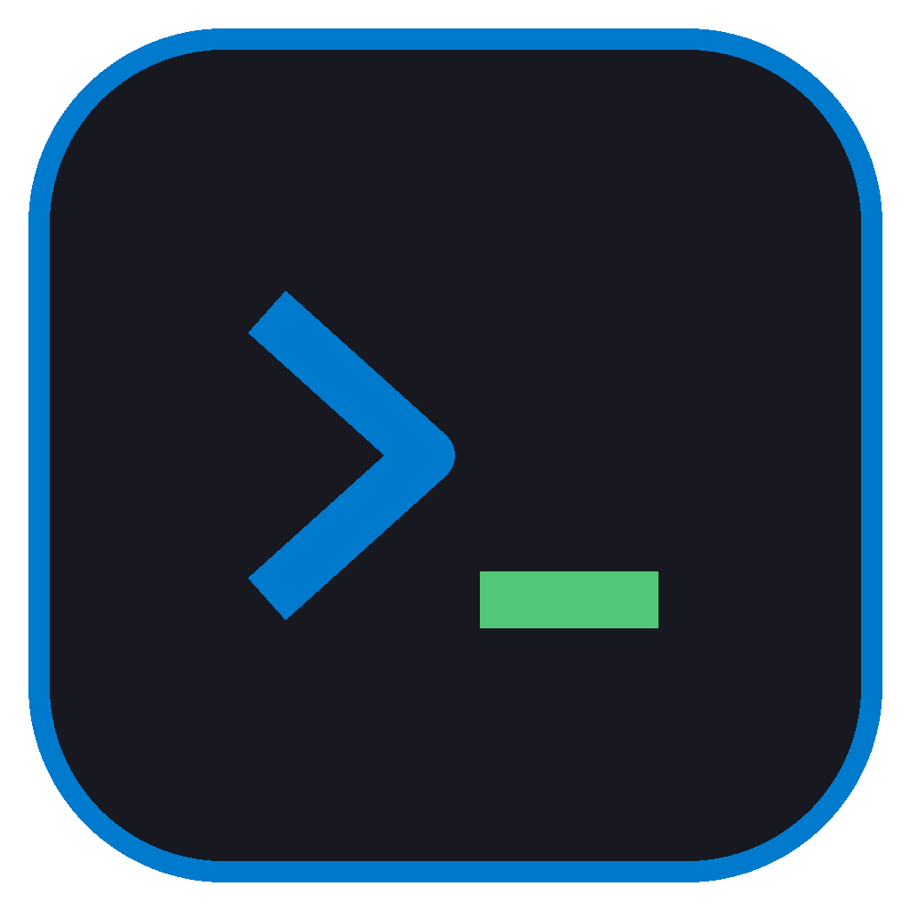
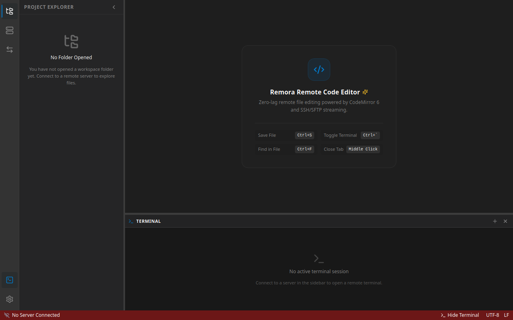
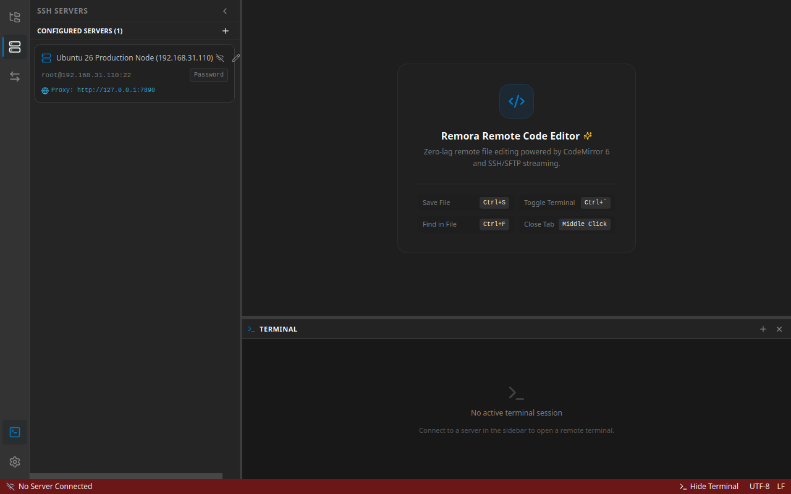

<div align="center">



# Remora

**轻量级、高性能的跨平台 SSH 远程工作区客户端**  
*A Lightweight, Blazing-Fast SSH Remote Workspace Client for Desktop & Mobile*

[](https://github.com/xzsean666/Remora/releases)
[](https://tauri.app/)
[](https://www.rust-lang.org/)
[](https://react.dev/)
[](https://www.typescriptlang.org/)
[](#-安装与下载)
[](LICENSE)

<p align="center">
  <a href="#-核心理念与对比">核心理念</a> •
  <a href="#-核心特性矩阵">功能特性</a> •
  <a href="#-界面预览">界面预览</a> •
  <a href="#-系统架构">系统架构</a> •
  <a href="#-安装与下载">安装下载</a> •
  <a href="#-快速上手">快速上手</a> •
  <a href="#-常用快捷键">快捷键</a> •
  <a href="#-从源码构建">从源码构建</a>
</p>

</div>

---

## 📖 项目简介

**Remora** 是一款基于 **Tauri 2 + Rust + React** 构建的轻量级、工业级 **SSH 远程工作区客户端**。

它的核心交互理念是：
> **连接 SSH → 打开远程目录 → 像使用本地编辑器一样进行远程开发与管理。**

在传统远程开发中，我们常常需要面临两难抉择：使用 **VS Code Remote-SSH** 虽然功能强大，但其必须在远程服务器端注入数十到数百兆的 Node.js Agent 服务进程，高内存占用且弱网极易断连卡死；而传统的 SSH 终端软件（如 Tabby、Termius、FinalShell）又往往缺乏真正的“项目目录树 + 轻量代码编辑 + 深度 TMUX 协同”的集成工作流。

**Remora 为此而生**：它无需在远程服务器安装任何服务端 Daemon 或专属 Agent，纯靠标准 SSH2 与 SFTP 协议驱动，以极致的内存占用、毫秒级响应、强悍的弱网断线自愈能力，带来真正轻盈、沉浸的远程开发体验。

---

## 💡 核心理念与对比

| 维度 | 传统 SSH 客户端 (Termius / Tabby 等) | VS Code Remote-SSH | **Remora (本项目)** |
| :--- | :--- | :--- | :--- |
| **服务器端侵入性** | 0 侵入，标准 SSH | ⚠️ **重度侵入**: 强制下载并运行几百 MB 的 Node.js 服务端 Agent | 🌟 **0 侵入**: 纯标准 SSH2 + SFTP 协议，不污染远程环境 |
| **远程资源占用** | 极低（仅产生一个登录 Shell） | ❌ 占用高达 100MB ~ 1GB+ 内存，低配云主机经常 OOM 崩溃 | 🌟 **近乎零占用**: 远端仅维持标准 `sshd` 与 `sftp-server` 进程（< 5MB） |
| **项目工作区集成** | 弱（大多为独立 SFTP 窗口或双栏文件管理） | 强大，基于完整 IDE 体系 | 🌟 **原生轻量**: 针对单项目工作区深度优化，集成文件树、编辑器与底栏终端 |
| **弱网与断线保护** | 简单重连，正在执行与编辑的内容易丢失 | ❌ 断线重试常陷入长时间重连卡死，甚至丢弃未保存修改 | 🌟 **防丢码保障**: 本地 Buffer 绝不丢失，SFTP 僵尸死锁自愈，透明自动重连 |
| **TMUX 原生整合** | 纯手动命令控制，无视窗集成 | 无特殊集成 | 🌟 **一等公民**: 可视化 TMUX 会话管理、单会话独占、**无感静默接入 (Stealth Attach)** |
| **终端性能与流传输** | 传统 IPC 或 Electron，大日志输出易掉帧 | 良好 | 🌟 **极速流式**: 基于 Tauri 2 二进制通道直推 xterm.js，免 JSON 开销，带 WebGL 加速 |
| **移动端支持** | 多数仅为纯终端键盘输入 | 网页版/Code Server 对手机触屏极不友好 | 🌟 **全能响应式**: 3-Tab 触控保活、终端虚拟按键条、Android 原生 APK |

---

## ✨ 核心特性矩阵

### 1. 🖥️ SSH 多服务器并发与企业级安全
- **全能凭据认证**: 原生支持账号密码认证、SSH 私钥认证（RSA / Ed25519 / ECDSA，支持 Passphrase 口令保护）以及本地 `ssh-agent` / `SSH_AUTH_SOCK` 代理（兼容 1Password / GPG Agent）。
- **零明文安全存储**: 密码与私钥口令交由操作系统级钥匙串管理（Linux SecretService / macOS Keychain / Windows Credential Manager / Android 专属沙盒隔离），严禁任何敏感数据明文落盘。
- **OpenSSH 互操作与快速导入**: 一键导入解析用户的 `~/.ssh/config` 配置；支持直接粘贴终端 SSH 命令行（如 `ssh -p 2222 root@192.168.1.100`）智能分词提取填入。
- **多服务器并发隔离**: 后端并发维护独立的 SSH 连接句柄与心跳保活机制，一键切换当前“活动服务器 (Active Server)”，工作区、终端与编辑器自动联动。

### 2. 📁 VS Code 体验的远程项目资源管理器 (Project Explorer)
- **严格懒加载 (Strict Lazy Loading)**: 仅在展开目录时按需通过 SFTP `readdir` 获取，配合虚拟化渲染，即使远程目录包含几十万个文件（如大规模 monorepo）也能秒级响应。
- **开发依赖智能过滤**: 默认智能折叠与静默忽略 `.git`、`node_modules`、`target`、`vendor` 等庞大依赖与临时目录。
- **丰富文件操作**: 支持新建文件、新建文件夹、重命名、删除、下载至本地、复制路径等常用操作。
- **远端安全回收站**: 支持将文件移动到服务器临时回收站，防止误删危险代码。
- **桌面拖拽上传**: 支持从本地桌面将文件或整个文件夹直接拖放至远程资源管理器的目标节点，内置同名文件冲突检测与一键“覆盖/重命名”弹窗决策。
- **僵尸通道自愈与前台恢复**: 解决长时间闲置后远端超时导致的 SFTP 僵尸通道死锁，自动剔除死会话并透明重连；App 切回前台自动探测连通性并刷新目录，告别虚假 "Empty folder" 错误。

### 3. 📝 轻量高效的代码编辑器与防丢码策略
- **现代编辑内核**: 基于 CodeMirror 6，搭配精心打磨的 One Dark 现代暗色主题。
- **Tab 标签管理**: 完美支持“单击快速预览 (Preview Tab)”与“双击常驻编辑 (Edit Tab)”，支持多文件并行切换。
- **常用代码特性**: 智能语法高亮、行号显示、括号匹配、全文搜索替换 (`Ctrl + F`)。
- **远程极速保存 (`Ctrl + S`)**: 极低延迟写回远程文件，并在保存时比对远程文件修改时间（`mtime`），遇到并发修改时弹出冲突对比面板，杜绝静默覆盖。
- **本地 Buffer 绝对安全**: 即使遭遇断网、服务器重启或连接闪断，前端 Zustand 状态机始终完整保护当前未保存代码，重连后可一键重新保存，绝不丢码。

### 4. ⚡ 毫秒级低延迟集成终端 (Integrated Terminal)
- **高性能底层流传输**: 深度利用 Tauri 2 专用的二进制 IPC 通道 (`Channel<Vec<u8>>`)，终端字节流直接写入 xterm.js，彻底规避传统 JSON 序列化性能瓶颈，应对超大日志打印（如 `cat`、`tail -f`、高频编译输出）毫无卡顿。
- **显示与自适应增强**: 支持 WebGL 硬件加速，窗口大小调整时实时通过 Rust 向远程 PTY 发送 `SIGWINCH` 同步行列尺寸。
- **完整 CJK 与 IME 修复**: 完美支持中日韩字符宽度对齐，彻底修复输入法拼音合成阶段重复上屏与按键乱码缺陷。
- **远程代理自动注入**: 在服务器配置中填入代理（如 `127.0.0.1:7890`），终端交互式 Shell 启动时自动注入全套标准环境变量（`http_proxy`、`https_proxy`、`all_proxy`、`no_proxy` 等），内置覆盖 Docker、局域网与回环地址白名单，拉取海外代码、依赖极速顺畅。
- **全局快捷指令条 (Quick Snippets)**: 终端上方集成常用命令快捷条，支持分组管理、一键填入/直接发送执行，并支持全量导入/导出为 JSON 文件。

### 5. 🪟 TMUX 深度集成与“无感静默接入” (Stealth Attach)
- **可视化会话管理面板**: 一键列出当前服务器的所有 TMUX 会话，支持界面化新建会话、重命名、一键挂载接入或安全销毁。
- **单会话单终端独占**: 挂载已打开的 TMUX 会话时自动释放旧终端，防止后台终端实例无限堆叠泄漏。
- **无感静默接入 (Stealth Attach)**: 独创流式数据拦截器与全屏沉浸加载遮罩，在进入 TMUX 前自动剥离前置 Shell 提示符与 `tmux attach` 命令输入打字回显，捕获到终端交替视窗序列后瞬间直接渲染原生 TMUX 界面，体验行云流水。
- **会话持久保持与断线续连**: 终端断开重连后 100% 自动重新 attach 原 TMUX 会话，保障长时间跑脚本、训练模型与编译任务永不掉线。

### 6. 📱 移动端全功能响应式适配 (Mobile-First Android)
- **移动端 3-Tab 视图**: 在手机与平板屏幕上自适应切换“工作区”、“编辑器”与“终端”三板块。
- **DOM 级保活机制 (Keep-Alive)**: 切换 Tab 时底层组件绝不销毁卸载，PTY 后台进程持续运行，xterm 实例与 TMUX 现场持续存活。
- **移动端虚拟按键条**: 针对手机触控键盘缺失开发快捷键的痛点，悬浮提供 `Esc`、`Tab`、`Ctrl`、`Alt`、方向键等高频键位辅助。
- **沙盒持久化隔离**: 基于 Tauri 2 原生路径解析，将 SQLite 数据库与凭据持久化至 Android 应用沙盒（`/data/user/0/com.remora.app/files`），App 进程划掉重启数据永不丢失。
- **自适应图标与安全区**: 完美匹配全面屏 Safe Area 避让，配备 `#181820` 专属暗黑自适应品牌图标。

### 7. 🔄 后台传输管理器与桌面集成
- **非阻塞后台传输**: 采用分块流式处理（Chunked Transfer），支持实时进度百分比、已传输大小、速度统计以及暂停、取消和失败重试。
- **Linux 桌面深度集成**: 支持 Ubuntu / Debian 任务栏 Dock 图标右键菜单直接触发“打开新窗口”，并在应用内支持 `Ctrl + Shift + N` 开启多窗口多项目并行开发。
- **内建全自动更新器**: 深度集成 GitHub Releases 与 Tauri 自动更新插件，新版本发布时应用内自动提醒并一键平滑升级。

---

## 🖼️ 界面预览

| 项目工作区与文件树 | 服务器连接管理器 |
| :---: | :---: |
|  |  |

---

## 🏗️ 系统架构

Remora 采用前后端分离的高性能混合架构：

```text
┌──────────────────────────────────────────────────────────────────────────────┐
│                              Remora Frontend (Webview)                       │
│                                                                              │
│   ┌───────────────┐  ┌───────────────────┐  ┌────────────────────────────┐   │
│   │ Activity Bar  │  │ Project Explorer  │  │       Editor Area          │   │
│   │ - Explorer    │  │  - File Tree View │  │   - CodeMirror 6           │   │
│   │ - Servers     │  │  - Lazy Loading   │  │   - Multi-Tab Manager      │   │
│   │ - Quick Input │  │  - Context Menu   │  │   - Dirty Buffer Store     │   │
│   │ - Transfers   │  │  - Drag & Drop    │  │   - Conflict Detection     │   │
│   └───────────────┘  └───────────────────┘  └────────────────────────────┘   │
│                      ┌───────────────────────────────────────────────────┐   │
│                      │              Terminal Panel (Bottom)              │   │
│                      │   - xterm.js Multi-Tabs & WebGL Acceleration      │   │
│                      │   - TMUX Visual Session Manager & Stealth Attach  │   │
│                      │   - Quick Input Snippets Toolbar                  │   │
│                      └───────────────────────────────────────────────────┘   │
│   ────────────────────────────────────────────────────────────────────────   │
│   Zustand Stores: connectionStore, fileTreeStore, editorStore,               │
│                   terminalStore, quickSnippetStore, transferStore            │
└──────────────────────────────────────┬───────────────────────────────────────┘
                                       │ Tauri 2 IPC Commands & Streaming Channels
┌──────────────────────────────────────▼───────────────────────────────────────┐
│                           Rust Core (Tauri 2 Backend)                        │
│                                                                              │
│  ┌───────────────────────┐ ┌───────────────────────┐ ┌─────────────────────┐ │
│  │   ConnectionManager   │ │    TerminalManager    │ │   TransferManager   │ │
│  │  - russh SSH2 Client  │ │  - PTY Multiplexing   │ │  - Chunked Worker   │ │
│  │  - Keepalive & Retry  │ │  - Tauri Channel Tx   │ │  - Resume Support   │ │
│  │  - Active Switching   │ │  - SIGWINCH Resize    │ │  - Progress Events  │ │
│  └──────────┬────────────┘ └───────────┬───────────┘ └──────────┬──────────┘ │
│             │                          │                        │            │
│  ┌──────────▼────────────┐ ┌───────────▼───────────┐ ┌──────────▼──────────┐ │
│  │      SftpService      │ │     StorageService    │ │    SecurityService  │ │
│  │  - Metadata / Readdir │ │  - SQLite (rusqlite)  │ │  - OS Keyring       │ │
│  │  - Read / Write File  │ │  - Servers & Projects │ │  - SSH Agent / Sock │ │
│  │  - Zombie Session Fix │ │  - Snippets & Layout  │ │  - ~/.ssh/config    │ │
│  └───────────────────────┘ └───────────────────────┘ └─────────────────────┘ │
└──────────────────────────────────────┬───────────────────────────────────────┘
                                       │ Standard SSH2 & SFTP Protocol (TCP)
┌──────────────────────────────────────▼───────────────────────────────────────┐
│                              Remote Linux Server                             │
│       - Standard SSHD (Port 22)                                              │
│       - SFTP Subsystem (Internal / sftp-server)                              │
│       - Shell Sessions & TMUX (/bin/bash, /bin/zsh, tmux)                    │
└──────────────────────────────────────────────────────────────────────────────┘
```

### 技术栈选型

| 层次 | 选型 | 版本/规范 | 决策理由 |
| :--- | :--- | :--- | :--- |
| **桌面/移动运行时** | [Tauri](https://tauri.app/) | 2.x | 极低内存开销，启动毫秒级，安全沙箱与高性能 Rust 原生绑定 |
| **前端框架** | [React](https://react.dev/) + [TypeScript](https://www.typescriptlang.org/) | 19.x / 5.x | 生态成熟，严格强类型，卓越的组件化与性能 |
| **状态管理** | [Zustand](https://github.com/pmndrs/zustand) | 5.x | 极简、无冗余样板代码、高性能不可变状态机 |
| **代码编辑器** | [CodeMirror](https://codemirror.net/) | 6.x | 模块化、超轻量、长文件性能优异、移动触控与 IME 友好 |
| **集成终端** | [xterm.js](https://xtermjs.org/) | 5.x | 工业级终端模拟器，完美支持 ANSI 颜色、Unicode 与 IME 输入法 |
| **样式与布局** | [TailwindCSS](https://tailwindcss.com/) | 3.4.x | 高度自由的 Flex/Grid 响应式排版，打造 VS Code 风格折叠面板 |
| **异步运行时** | [Tokio](https://tokio.rs/) | 1.x | Rust 工业级高并发多线程异步运行时 |
| **SSH 协议栈** | [russh](https://github.com/warp-tech/russh) + `russh-sftp` | 0.63 / 2.4 | 纯 Rust 编写的异步 SSH2/SFTP 协议，安全无 C 依赖 |
| **本地存储** | [SQLite](https://www.sqlite.org/) (`rusqlite`) | 3.33+ (bundled) | 零配置单文件数据库，用于项目历史、凭证索引与自定义指令 |
| **安全存储** | [keyring-rs](https://github.com/hwchen/keyring-rs) | 3.x | 原生接入操作系统钥匙串，杜绝密码明文落地 |

---

## 📦 安装与下载

请前往 [GitHub Releases](https://github.com/xzsean666/Remora/releases) 下载最新版本的安装包。

### 1. Linux 桌面端安装

#### 方式 A: Debian / Ubuntu (`.deb` 安装包，推荐)
```bash
# 下载对应的 deb 安装包后安装：
sudo dpkg -i remora_*_amd64.deb
# 或使用 apt 自动补齐依赖安装：
sudo apt install ./remora_*_amd64.deb
```

#### 方式 B: 通用 Linux (`.AppImage` 免安装单文件)
```bash
# 赋予执行权限并直接运行：
chmod +x remora_*.AppImage
./remora_*.AppImage
```

> **提示 (Ubuntu 22.04+ 用户)**: 如果运行 AppImage 提示缺少 FUSE，请通过 `sudo apt install libfuse2` 安装支持库。

---

### 2. Android 手机端安装

1. 从 Release 页面下载最新的 `remora-universal-release-*.apk`（通用架构）或 `remora-aarch64-release-*.apk`。
2. 传至手机后点击直接安装。
3. 手机端支持触控手势、底部 3-Tab 切换与全套终端辅助按键。

---

## 🚀 快速上手

### 步骤 1: 添加 SSH 服务器
1. 打开 Remora，点击左侧 Activity Bar 的 **Servers (服务器图标)**。
2. 点击 **"Add Server"** 按钮打开配置弹窗。
3. 输入服务器名称、主机 IP、端口（默认 22）及用户名。
4. 选择认证方式：
   - **Password (密码)**: 输入密码（系统将安全存入 Keyring）。
   - **Private Key (私钥)**: 选取本地 `id_ed25519` / `id_rsa` 私钥文件或直接粘贴密钥内容（如有 passphrase 请一并填写）。
   - **SSH Agent**: 自动对接本地已运行的 SSH 代理。
5. *(可选)* 填入远程代理配置（如 `127.0.0.1:7890`），Remora 将自动注入终端环境变量。
6. 点击 **"Save & Connect"**。

> 💡 **小窍门**: 你也可以在弹窗顶部点击 **"Parse SSH Command"**，直接粘贴 `ssh -p 22022 user@server.example.com` 自动填充！

---

### 步骤 2: 打开远程工作区项目
1. 服务器连接成功后，点击左侧 Activity Bar 的 **Explorer (资源管理器图标)**。
2. 点击 **"Open Folder" (打开文件夹)**。
3. 在弹窗中输入你想要打开的远程目录路径（例如 `/root/workspace/my-app` 或 `~/project`），或点击快速填充家目录 `~`。
4. 点击确定，远程目录树将立即呈现在侧边栏中。

---

### 步骤 3: 编写代码与使用终端
- **浏览与编辑**:
  - 单击文件快速预览，双击文件常驻为标签页。
  - 编辑内容后，按下 <kbd>Ctrl</kbd> + <kbd>S</kbd> 极速保存至远程服务器。
- **执行命令**:
  - 底部终端面板默认自动 `cd` 进入当前打开的工作区根目录。
  - 自由运行编译、运行测试或部署脚本。
  - 使用终端上方的 **Quick Input (快捷输入)** 工具条，一键触发常用命令。

---

### 步骤 4: 使用 TMUX 会话
1. 点击底部终端面板标题栏上的 **TMUX 图标**。
2. 在弹出的会话管理器中，可一览远程已有的全部 TMUX 会话。
3. 点击任意会话即可通过 **Stealth Attach** 瞬间静默接入，零命令输入回显，畅享原生 TMUX 体验。

---

## ⌨️ 常用快捷键

### 桌面通用快捷键

| 快捷键 | 功能说明 |
| :--- | :--- |
| <kbd>Ctrl</kbd> + <kbd>S</kbd> | 保存当前活动编辑器的远程文件 |
| <kbd>Ctrl</kbd> + <kbd>W</kbd> | 关闭当前活动的编辑器 Tab 标签页 |
| <kbd>Ctrl</kbd> + <kbd>F</kbd> | 在当前代码编辑器中打开搜索与替换框 |
| <kbd>Ctrl</kbd> + <kbd>Shift</kbd> + <kbd>N</kbd> | 打开一个全新的 Remora 独立应用窗口 |
| <kbd>Ctrl</kbd> + <kbd>`</kbd> | 聚焦或切换到底部终端面板 |
| <kbd>Ctrl</kbd> + <kbd>C</kbd> / <kbd>Ctrl</kbd> + <kbd>V</kbd> | 终端中选中文本自动复制 / 粘贴剪贴板文本 |

### 移动端辅助按键条 (Mobile Bar)
在 Android 端打开终端时，底部常驻浮动按键条：
- `ESC` • `TAB` • `CTRL` • `ALT` • `~` • `/` • `-` • `|` • `▲` • `▼` • `◀` • `▶`

---

## 🛠️ 从源码构建

如果你希望为 Remora 贡献代码或本地构建调试，请遵循以下步骤：

### 1. 环境准备
- **Node.js**: >= 20.0.0
- **包管理器**: 必须严格使用 `pnpm` (`corepack enable pnpm`)
- **Rust 工具链**: >= 1.75.0 (`rustup default stable`)
- **Linux 本地依赖 (Ubuntu/Debian)**:
  ```bash
  sudo apt-get update
  sudo apt-get install -y libwebkit2gtk-4.1-dev libappindicator3-dev librsvg2-dev patchelf libssl-dev file libfuse2
  ```

### 2. 克隆仓库与安装依赖
```bash
git clone https://github.com/xzsean666/Remora.git
cd Remora
pnpm install
```

### 3. 本地开发模式
```bash
# 启动 Tauri 2 桌面端热重载开发环境
pnpm dev:tauri
```

### 4. 自动化构建打包
项目中内置了经过工业级验证的跨平台构建脚本 `build.sh`：

```bash
# 编译并打包 Linux 桌面 Release 二进制与 .deb 安装包：
./build.sh --deb

# 编译 Android APK 安装包（需本地配置 Android SDK & NDK）：
./build.sh --apk

# 仅构建 release 二进制文件（快速自测）：
./build.sh --no-bundle
```

打包生成的所有产物将自动归档至：
- 桌面端: `release/desktop/`
- 移动端: `release/android/`

### 5. 运行测试套件
```bash
# 运行 Rust 后端全部单元测试与集成测试
cargo test --manifest-path src-tauri/Cargo.toml

# 运行前端 TypeScript 静态类型检查
pnpm tsc --noEmit
```

---

## 🗺️ 路线图 (Roadmap)

- [x] 多服务器连接管理与凭据安全加密存储 (Keyring)
- [x] 远程文件树懒加载、新建/重命名/删除与本地拖拽上传
- [x] CodeMirror 6 代码编辑、`Ctrl+S` 保存与远程冲突检测
- [x] xterm.js 终端集成、Tauri 2 二进制通道与 CJK/IME 适配
- [x] 远程服务器代理配置与环境变量自动注入
- [x] TMUX 可视化会话管理、独占约束与无感静默接入 (Stealth Attach)
- [x] SFTP 闲置断连自愈、僵尸通道自动剔除与唤醒自动刷新
- [x] 移动端 3-Tab 响应式布局、DOM 级保活与辅助键盘
- [x] Android 原生 APK 打包构建与 GitHub Actions 自动发布流水线
- [ ] 远程工作区全文文件内容搜索 (Ripgrep 远程集成)
- [ ] 终端分屏 (Vertical & Horizontal Split Terminal)
- [ ] 常用 SSH 隧道与端口转发可视化管理 (Port Forwarding)

---

## 🤝 参与贡献与开发规范

欢迎任何形式的 Issue、建议与 PR！

在提交代码前，请注意：
1. **代码规范**: 前端遵循 TypeScript 严格模式，后端遵循 Rust 标准格式 (`cargo fmt`) 与 Clippy 校验。
2. **包管理器**: 前端严格使用 `pnpm`，禁止引入 npm 或 yarn 锁文件。
3. **AI 辅助规范**: 如果使用 AI 代理协同开发，必须严格遵循项目根目录下的 [`AGENTS.md`](AGENTS.md) 规则与 `docs/AI/` 任务索引流程。

---

## 📄 开源许可证

本项目基于 [MIT License](LICENSE) 开源。

Copyright (c) 2026 Remora Team.
